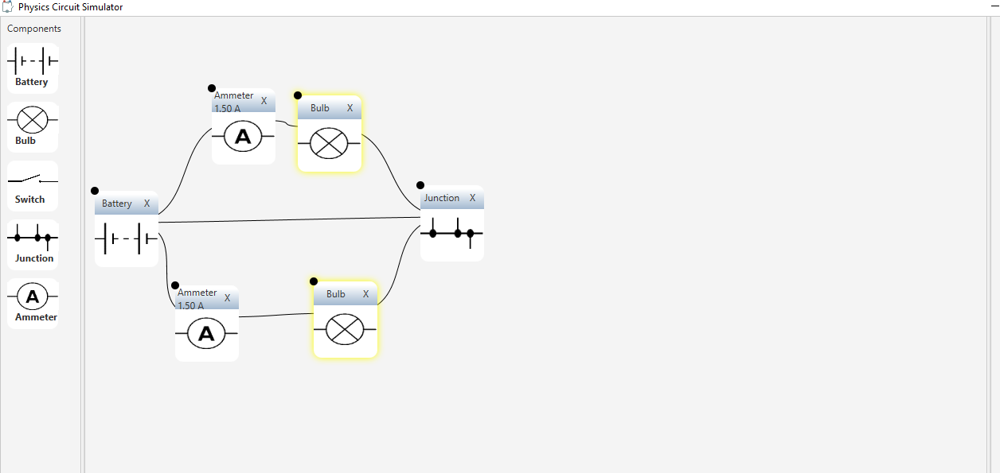
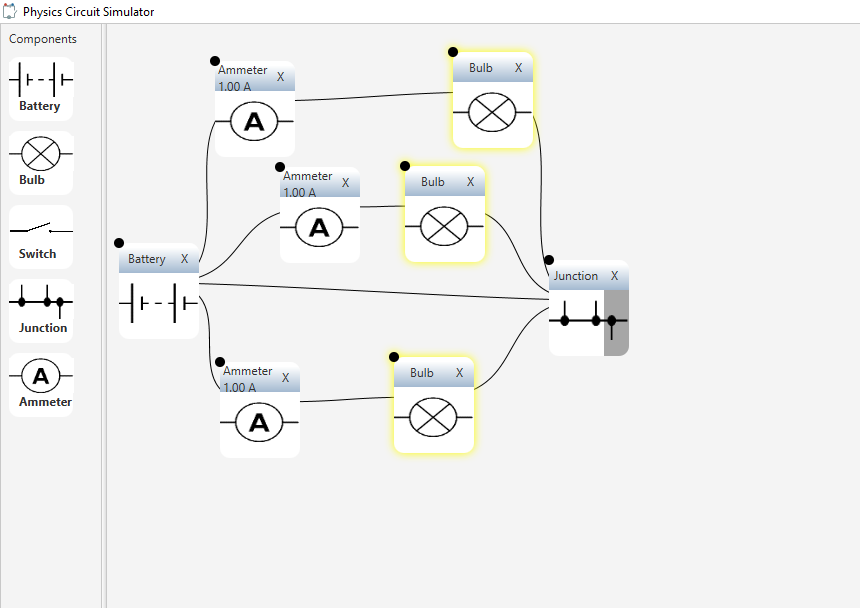
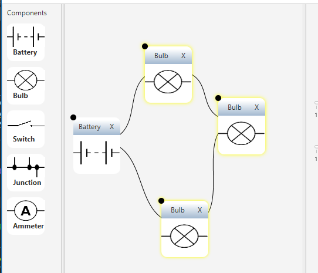
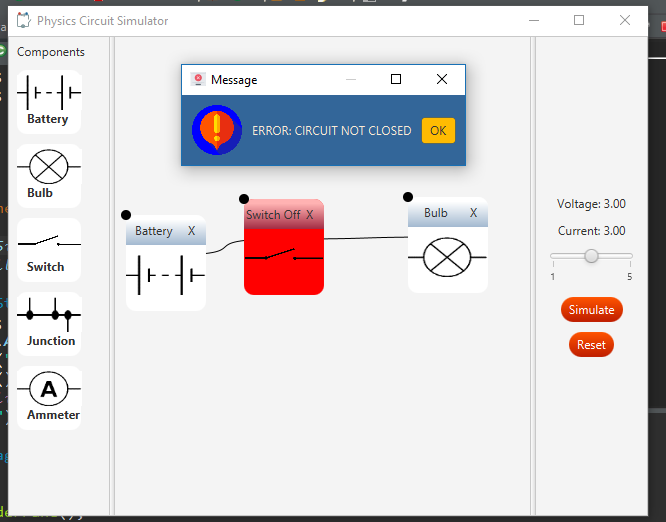
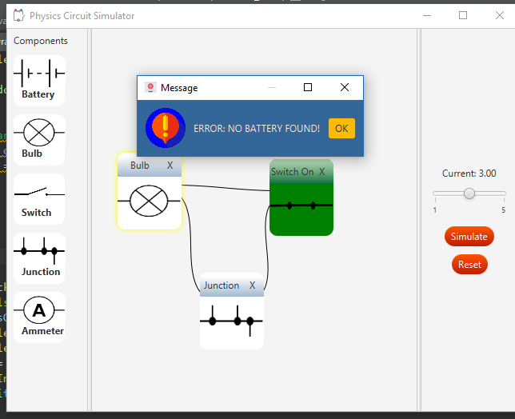

# Physics Circuit Simulator

## Symbols Used

* Battery with specified current levels
* Switches (open/closed)
* Ammeter for measuring current
* Bulbs that glow as per the intensity of voltage levels
* Junctions that can be used to join wires at a particular point

## Demo

## Sample Screenshots

### Workflow

### Error Depictions

## Sources of Images Used:

* FlatIcon for images

Icons made by <a href="https://www.flaticon.com/authors/freepik" title="Freepik">Freepik</a> from <a href="https://www.flaticon.com/"             title="Flaticon">www.flaticon.com</a> is licensed by <a href="http://creativecommons.org/licenses/by/3.0/"             title="Creative Commons BY 3.0" target="_blank">CC 3.0 BY</a>

* Circuit symbols taken from [Electronics Club](https://electronicsclub.info/circuitsymbols.html)

## How to Use

* Command line:
	* `java -jar circuit_simulator.jar`
* Double clicking the application (provided you have a valid JRE installed should work too!)
* Running the Main.java file